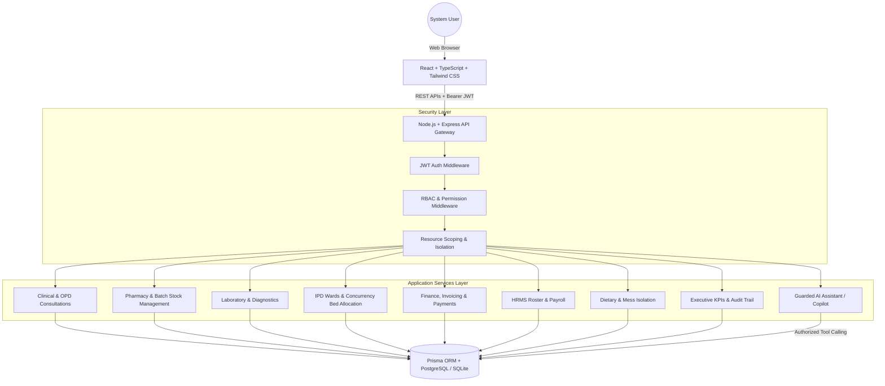

# 🏥 AegisCare - Hospital Management & Operations System

A full-stack, role-based, demo-ready **Hospital Management & Operations System** built with **React**, **TypeScript**, **Tailwind CSS**, **Node.js/Express**, **Prisma ORM**, and an **Authorized AI Health Assistant & Admin Copilot Layer**.

Built strictly following the **Level-1 System Architecture** and **Role-Based Access Control (RBAC) Table**.

---

## 🌟 Key Highlights & Engineering Features

- **Interactive Role Portal ("Login As")**: Starting page featuring 9 1-click role switcher cards (`ADMIN`, `DOCTOR`, `NURSE`, `PATIENT`, `PHARMACY`, `LAB`, `FINANCE`, `HRMS`, `MESS`) and custom email/password authentication.
- **Strict Backend RBAC**: Dynamic middleware (`requireAuth`, `requireRole`, `requirePermission`) preventing unauthorized API access. Frontend hiding is backed by server-side verification.
- **Resource-Level Access Scoping**: Patients only access their own medical history, bills, and prescriptions; Nurses see assigned ward patients; Mess staff sees meal schedules and bed numbers *without* clinical diagnoses or prescriptions.
- **Atomic Database Transactions**:
  - **Pharmacy Dispensing**: Simultaneously decrements medicine batch stock, marks prescription as dispensed, and automatically generates an itemized Charge in Finance.
  - **Inpatient Bed Allocation**: Prevents race conditions and double-booking beds during admissions.
  - **Billing & Settlement**: Aggregates departmental charges (OPD, Pharmacy, Lab, IPD stay) into Invoices, allows authorized Finance/Admin discounts (preserving original charges), and records payment receipts.
- **Guarded AI Layer**: Patient AI Assistant & Admin Operations Copilot with role-scoped tool execution (`getMyAppointments`, `getMyPrescriptions`, `getExecutiveOverview`, `getLowStockAlerts`, `getRevenueByDepartment`). LLMs never query raw SQL directly. Works 100% offline out-of-the-box with deterministic intelligence, or with OpenAI/Gemini API keys.

---

## 🏗️ System Architecture



---

## 🛡️ Role-Based Access Control (RBAC) Matrix

| Module | ADMIN | DOCTOR | NURSE | PATIENT | PHARMACY | LAB | FINANCE | HRMS | MESS |
| :--- | :---: | :---: | :---: | :---: | :---: | :---: | :---: | :---: | :---: |
| **User Management** | Full | — | — | — | — | — | — | — | — |
| **Appointments** | Full | Update | Read/Update | Create/Read | — | — | Read | — | — |
| **Patient Profile** | Full | Read/Update | Read | Read/Update (Own) | Read (Limited) | Read (Limited) | Read (Limited) | — | Read (Limited) |
| **Clinical Diagnosis** | Full | Create/Update | Read | Read | — | — | — | — | — |
| **Prescriptions** | Full | Create/Update | Read | Read | Read | — | — | — | — |
| **Medical Reports** | Full | Create/Update | Read (Limited) | Read (Own) | — | Create/Update (Lab) | — | — | — |
| **Vitals Recording** | Full | Read | Create/Update | Read (Own) | — | — | — | — | — |
| **Nursing Notes** | Full | Read | Create/Update | — | — | — | — | — | — |
| **Medication Admin** | Full | Read | Create/Update | Read (Own) | Read | — | — | — | — |
| **IPD Admissions** | Full | Create/Update | Read | Read (Own) | — | — | Read | — | — |
| **Bed Management** | Full | Read | Read/Update | Read (Own) | — | — | Read | — | — |
| **Laboratory** | Full | Create | Read | Read (Own) | — | Full | Read (Charges) | — | — |
| **Pharmacy** | Full | Create | Read | Read (Own) | Full | — | Read (Charges) | — | — |
| **Inventory & Supplies** | Full | — | — | — | Create/Update | Create/Update | Read | — | Create/Update (Food) |
| **Oxygen Cylinders** | Full | Read | Create/Update | — | — | — | Read | — | — |
| **Diet Plans & Mess** | Full | Create/Update | Read | Read (Own) | — | — | — | — | Read/Full (Fulfillment) |
| **Billing & Invoices** | Full | Read | Read (Limited) | Read (Own) | Create (Charges) | Create (Charges) | Full | — | Create (Charges) |
| **Discounts** | Full | — | — | — | — | — | Full | — | — |
| **Payments** | Full | — | — | Create/Read (Own) | — | — | Full | — | — |
| **HRMS & Staff** | Full | — | — | — | — | — | — | Full | — |
| **Attendance & Leave** | Full | Create/Read (Own) | Create/Read (Own) | — | Create/Read (Own) | Create/Read (Own) | Create/Read (Own) | Full | Create/Read (Own) |
| **Payroll Records** | Full | — | — | — | — | — | Read | Full | — |
| **Audit Logs** | Full | — | — | — | — | — | — | — | — |
| **AI Assistant / Copilot** | Full | — | — | Full (Own) | — | — | — | — | — |

---

## ⚡ Main Clinical to Financial Workflow

```
[PATIENT] Books OPD Appointment
    ↓
[DOCTOR] Conducts Consultation → Adds Symptoms, Notes & Vitals
    ↓
[DOCTOR] Issues ICD-10 Diagnosis + Prescribes Medicines + Orders Diagnostic Tests
    ↓
[AUTO CHARGE] OPD Consultation Fee Charge Generated
    ↓
[PHARMACY] Dispenses Prescription → Batch Stock Automatically Decremented in DB Transaction
    ↓
[AUTO CHARGE] Pharmacy Medicine Charge Generated
    ↓
[LABORATORY] Collects Specimen → Enters Results → Diagnostic Report Generated
    ↓
[AUTO CHARGE] Laboratory Diagnostic Charge Generated
    ↓
[FINANCE] Consolidates Departmental Charges into Official Invoice
    ↓
[FINANCE / ADMIN] Applies Authorized Discount (Original Charges Intact)
    ↓
[FINANCE / PATIENT] Records Payment via UPI / Card / Cash → Generates Official Receipt
```

---

## 🔑 Demo Accounts & Credentials

All demo accounts use the standard password: **`password123`**

| Role | Demo Login Email | Primary Responsibilities & UI Features |
| :--- | :--- | :--- |
| **ADMIN** | `admin@hospital.com` | Full Control Center, KPIs, User Roles, Audit Logs, Analytics & AI Copilot |
| **DOCTOR** | `doctor@hospital.com` | OPD Queue, Consultation Studio, Rx Builder, Lab Orders, EHR History |
| **NURSE** | `nurse@hospital.com` | Inpatient Ward Matrix, Vitals Logger, Nursing Notes, Med Admin Log |
| **PATIENT** | `patient@hospital.com` | Personal Portal, Book Appointments, View Prescriptions, Reports & Bills |
| **PHARMACY** | `pharmacy@hospital.com` | Prescription Queue, Atomic Dispensing, Medicine Batches, Inventory |
| **LAB** | `lab@hospital.com` | Diagnostic Orders Queue, Sample Barcoding, Result Entry, Test Reports |
| **FINANCE** | `finance@hospital.com` | Unbilled Charges, Invoice Generator, Discounts, Payment Receipts |
| **HRMS** | `hrms@hospital.com` | Staff Roster, Attendance Log, Leave Requests & Approvals, Payroll |
| **MESS** | `mess@hospital.com` | Patient Meal Delivery Schedule, Fulfillment Toggles (Redacted Privacy) |

---

## 🛠️ Technology Stack

### Frontend
- **React 18** with **TypeScript**
- **Vite 6** (Blazing fast HMR & production builds)
- **Tailwind CSS** (Clean, professional medical SaaS styling)
- **React Router DOM 6** (Role-based protected routing)
- **Lucide React** (Medical & operational icon set)
- **Recharts** (Department revenue & appointment velocity visualizations)
- **Axios** (Configured with JWT request/response interceptors)

### Backend
- **Node.js & Express** with **TypeScript**
- **Prisma ORM** (32 normalized relational models, constraints, and indexes)
- **PostgreSQL / SQLite** (Plug-and-play SQLite for instant local zero-config testing; PostgreSQL for production)
- **JWT (JSON Web Tokens)** & **bcryptjs** password hashing
- **Morgan & Helmet** (Security headers and HTTP request logging)
- **Supertest & Jest** (Comprehensive automated API test suite)

### AI Integration
- **Guarded Tool Execution Layer**: Verifies authentication and scoping before querying the database.
- **Intelligent Fallback Reasoning Engine**: Ensures natural language queries execute and demo 100% reliably without requiring external API keys.

---

## 🚀 Quickstart Installation Guide

### Prerequisites
- **Node.js**: v18.0.0 or higher (v20+ recommended)
- **npm** or **yarn**

### 1. Clone & Setup Backend
```bash
cd server
npm install
npm run prisma:push
npm run prisma:seed
```

### 2. Run Backend API Server
```bash
npm run dev
# Server will start on http://localhost:5000
```

### 3. Setup & Run Frontend Client
In a separate terminal window:
```bash
cd client
npm install
npm run dev
# Frontend will be live on http://localhost:5173
```

### 4. Running Automated Tests
```bash
cd server
npm test
```

---

## 📋 Comprehensive Interview Talking Points

1. **Why a Modular Monolith?**: Avoiding unnecessary distributed systems overhead while enforcing strict domain separation across services (Clinical, Pharmacy, Finance, IPD, HRMS).
2. **ACID Transaction Guarantees**: Why critical flows like Pharmacy Dispensing, IPD Bed Allocation, and Invoice Finalization use database transactions (`prisma.$transaction`) to prevent stock drift and bed double-booking.
3. **Defense in Depth RBAC**: Why UI element hiding is backed by server-side middleware and resource-level scoping (Patient ID verification).
4. **Guarded AI Architecture**: Why LLMs must never receive direct database connections; instead, the application employs validated tools with authentication tokens.
